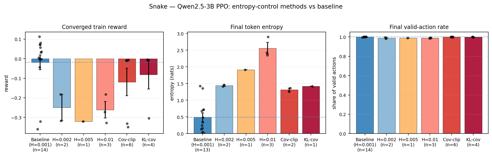

# Entropy-control methods don't help — Snake PPO

*Why this section.* The previous results showed that PPO does improve performance
on Snake. The question for this short closing section is whether standard
**loss-mediated exploration tweaks** — entropy regularisation, covariance
clipping, KL-covariance clipping — make that improvement bigger or more
robust. The answer (across model scales we tested) is *no*. This motivates the
shift to context-mediated exploration in the next section.

*Data.* `wandb.ai/jimdilkes/AAMAS_msrl`. Snake (FastSnake env), Qwen2.5-3B PPO.
"Baseline" = the production PPO run with default H=0.001. "H=0.002 / 0.005 /
0.01" = same recipe with the entropy coefficient bumped. "Cov-clip" and
"KL-cov" are the DAPO/ARPO-family clipping variants.

## Headline

| method             | n  | train reward   | default eval   | token entropy | valid-action rate |
|--------------------|----|----------------|----------------|---------------|-------------------|
| Baseline (H=0.001) | 14 | −0.02 ± 0.04   | **0.76 ± 0.10**| 0.49 ± 0.13   | 1.00 ± 0.00       |
| H=0.002            | 4  | −0.25 ± 0.07   | −0.39 ± 0.03   | 1.44 ± 0.03   | 0.99 ± 0.01       |
| H=0.005            | 2  | −0.32 ± 0.00   | −0.40 ± 0.00   | 1.91 ± 0.00   | 0.99 ± 0.00       |
| H=0.01             | 3  | −0.26 ± 0.04   | −0.24 ± 0.07   | 2.56 ± 0.17   | 0.99 ± 0.00       |
| Cov-clip           | 6  | −0.12 ± 0.07   | −0.30 ± 0.02   | 1.31 ± 0.05   | 1.00 ± 0.00       |
| KL-cov             | 5  | −0.08 ± 0.07   | −0.30 ± 0.04   | 1.42 ± 0.00   | 1.00 ± 0.00       |

*(values are mean ± standard error across seeds. Default-eval is greedy at T=0
on the training-distribution Snake env. Bolded = best converged-eval cell.)*

## What this says

1. **Entropy methods do raise token entropy** — H=0.01 takes the converged actor
   entropy from ~0.5 nats to ~2.6 nats (5×). Covariance-clip and KL-cov raise it
   to ~1.3 nats. So the methods do mechanically work.
2. **Converged reward does not follow.** Every entropy method *underperforms*
   the H=0.001 baseline on the held-out default eval (0.76 → −0.24 in the best
   case, much worse for H=0.005). The extra entropy buys nothing useful.
3. **Behavioural validity is unchanged.** The valid-action rate (share of agent
   outputs that parse as a legal Snake action) stays at ~99–100 % across every
   method. The extra entropy is being spent on token-level variation within
   already-well-formed actions, not on exploring new action patterns.

## Takeaway

Across the 3B PPO sweep, *raising the entropy bonus or applying the
DAPO/ARPO-family clipping variants successfully raised actor entropy but did
not improve — and often degraded — converged reward, and did not change the
behavioural-validity profile of the agent.* This negative result on the
loss-mediated exploration family motivates the **context-mediated exploration**
approach explored in the following section.
