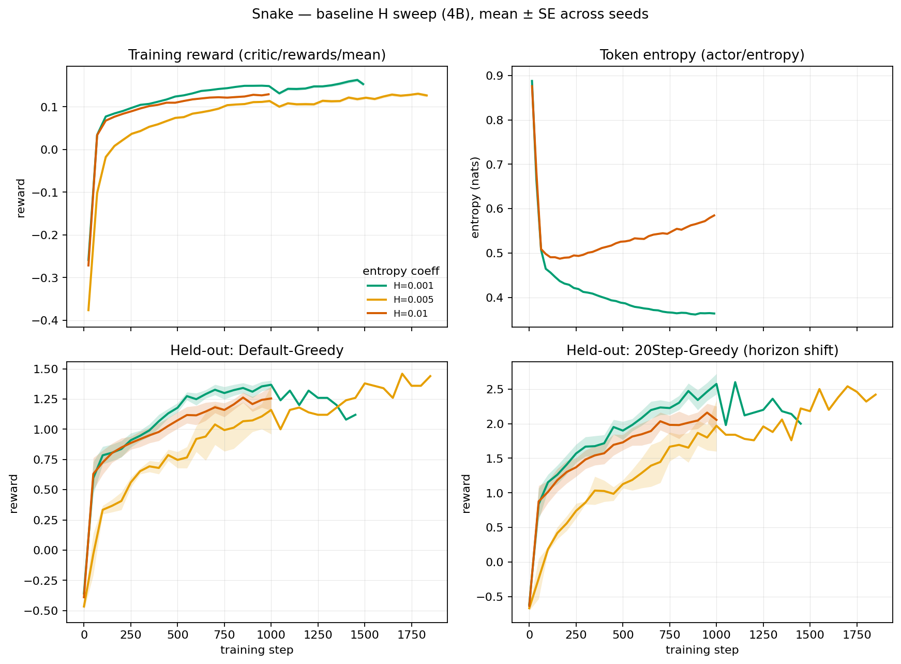
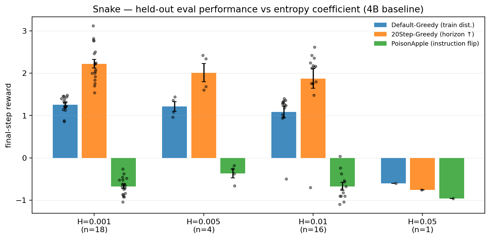
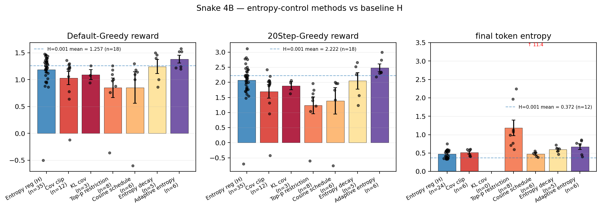
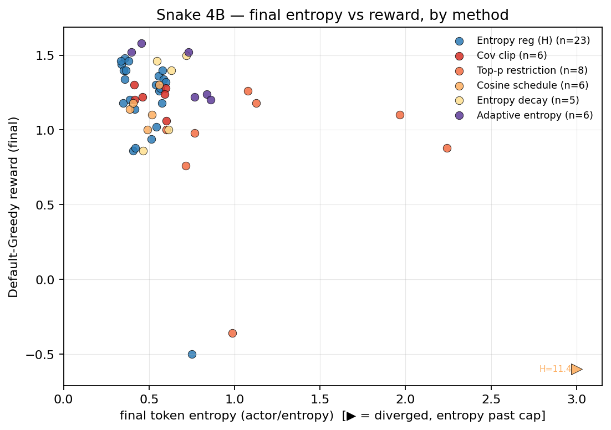

# Entropy-control methods on Snake — preliminary findings
*Source*: `wandb.ai/jimdilkes/verl_env`. Snake (FastSnake env), Qwen2.5-4B Instruct unless noted. All runs `state=finished`.

## Caveats
- Runs in `verl_env` predate the 2026-02-16 batch-size bug fix (`train_batch_size = n_rollouts × horizon`). Mid-episode weight updates were biasing GAE on all of these runs. Conclusions here are *relative comparisons under the same bias*, not absolute performance.
- Post-fix runs live in the `rl_sdm` project (CAIS v2 tag) and are not included here.
- A few groups have small n (klcov n=3, decay variants n=1–2). The headline message is robust *across* methods, not for individual H values within a method.

## Data scope
| bucket     | scale | H     | n runs |
|------------|-------|-------|--------|
| adaptive   | 4B    | —     | 6      |
| baseline_H | 0.5B  | 0.001 | 1      |
| baseline_H | 14B   | 0.005 | 2      |
| baseline_H | 4B    | 0.001 | 18     |
| baseline_H | 4B    | 0.005 | 4      |
| baseline_H | 4B    | 0.01  | 16     |
| baseline_H | 4B    | 0.05  | 1      |
| clipcov    | 4B    | 0.005 | 3      |
| clipcov    | 4B    | 0.01  | 3      |
| clipcov    | 4B    | —     | 6      |
| cosine     | 4B    | 0.001 | 2      |
| cosine     | 4B    | 0.01  | 4      |
| decay      | 4B    | —     | 5      |
| klcov      | 4B    | —     | 3      |
| topP       | 4B    | 0.01  | 14     |

## 1. Performance overview — training + held-out eval
Snake's held-out eval suite probes instruction-generalisation:
- **Default-Greedy** — same env as training (10×10, 8 rounds), T=0, in-distribution.
- **20Step-Greedy** — same env but `episode_length=20`, 5 apples — horizon shift.
- **PoisonAppleAndBanana-Greedy** — apple reward flipped to −1, banana +1 — *instruction flip*: the system prompt still describes the original rules; the env contradicts it.

### Final-step performance, baseline H sweep (4B)
| H     | n  | Default-Greedy | 20Step         | PoisonApple    | Token entropy  |
|-------|----|----------------|----------------|----------------|----------------|
| 0.001 | 18 | 1.257 ± 0.043  | 2.222 ± 0.103  | -0.673 ± 0.050 | 0.372 ± 0.009  |
| 0.005 | 4  | 1.210 ± 0.114  | 2.010 ± 0.215  | -0.370 ± 0.105 | —              |
| 0.01  | 16 | 1.085 ± 0.139  | 1.872 ± 0.231  | -0.674 ± 0.092 | 0.576 ± 0.017  |
| 0.05  | 1  | -0.600 ± 0.000 | -0.760 ± 0.000 | -0.960 ± 0.000 | 11.406 ± 0.000 |

Reading: H=0.001–0.005 cluster together on the training-distribution split; performance does not transfer to the PoisonApple split (instruction-flip generalisation is largely a failure across all H values).

## 2. Entropy-control methods — do they help?
Each method is benchmarked against the densest, best-performing baseline (H=0.001, n=18; dashed line in the bar plot). The H=0.05 baseline run (n=1, diverged: token entropy ≈11 nats, reward ≈−0.6) is excluded from method comparisons to avoid swamping the bars and scatter with one collapsed run.

Method bucket descriptions:
- **Entropy reg (H)** — pure entropy bonus in the PPO loss, swept H ∈ {0.001, 0.005, 0.01, 0.05}.
- **Cov clip** — covariance-clip from the DAPO/ARPO family; clips per-token policy gradients by token-advantage covariance.
- **KL cov** — variant of cov-clip thresholded by per-token KL.
- **Top-p restriction** — truncates the sampling distribution at top-p mass during rollout.
- **Cosine schedule** — cosine decay of the LR and/or H.
- **Entropy decay** — explicit linear/step schedule on H.
- **Adaptive entropy** — target-entropy controller (P-controller on actor/entropy bounds).

### Per-method final-step summary (4B, mean ± SE across seeds)
| method     | n  | Default-Greedy | 20Step        | PoisonApple    | Token entropy |
|------------|----|----------------|---------------|----------------|---------------|
| baseline_H | 38 | 1.187 ± 0.058  | 2.068 ± 0.105 | -0.639 ± 0.046 | 0.474 ± 0.023 |
| clipcov    | 12 | 1.030 ± 0.122  | 1.697 ± 0.223 | -0.510 ± 0.048 | 0.513 ± 0.038 |
| klcov      | 3  | 1.093 ± 0.093  | 1.887 ± 0.135 | -0.387 ± 0.098 | —             |
| topP       | 14 | 0.850 ± 0.182  | 1.235 ± 0.281 | -0.512 ± 0.111 | 1.185 ± 0.212 |
| cosine     | 6  | 0.853 ± 0.293  | 1.387 ± 0.438 | -0.677 ± 0.074 | 0.472 ± 0.033 |
| decay      | 5  | 1.244 ± 0.131  | 2.048 ± 0.277 | -0.472 ± 0.097 | 0.595 ± 0.042 |
| adaptive   | 6  | 1.380 ± 0.072  | 2.480 ± 0.130 | -0.500 ± 0.153 | 0.675 ± 0.081 |

## 3. Takeaway
**Training-distribution (Default-Greedy) eval.** Cov-clip, KL-cov, top-p restriction, cosine schedule and explicit entropy decay all sit at or below the H=0.001 baseline. Only adaptive entropy edges above (+0.12 mean, ~1.5 SE), and entropy decay matches. No method exceeds the best-tuned constant H by more than ~10 %.

**Horizon-shift (20Step-Greedy) eval.** Same ordering: adaptive entropy is the only method to exceed the H=0.001 baseline by a margin worth quoting (+0.26 mean, ~2 SE); everything else is at or below.

**Instruction-flip (PoisonApple) eval.** The most striking signal: *every* method sits between roughly −0.4 and −0.7 (with the worst-case floor at −1). The agent fails to override its original instruction even when the env hard-codes a reward inversion. No entropy-control method moves this dial.

**Token-entropy axis.** Loss-mediated methods that *raise* entropy (top-p, cosine) hurt reward. Methods that *lower* entropy (cov-clip, decay, adaptive) sit near the baseline trade-off curve. There is no out-of-the-pack point.

This is the motivating observation: standard entropy-control / exploration tweaks for PPO do not unlock instruction-generalisation on Snake, and barely move the training-distribution reward. The rest of the report explores context-mediated alternatives.
